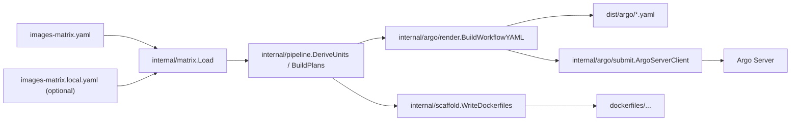
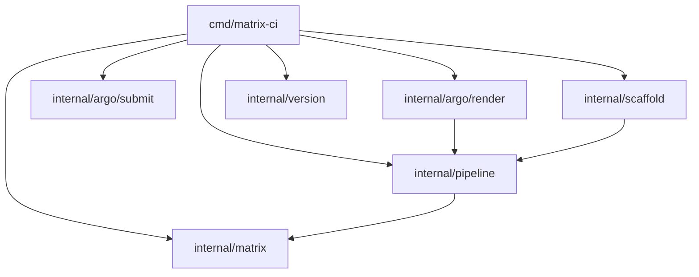

# K8Ace Matrix Code Wiki

## 1. 项目概览

`k8ace-matrix` 是一个以 `images-matrix.yaml` 为唯一事实来源的镜像构建编排仓库。它的核心目标不是“直接构建镜像”，而是围绕一份矩阵配置，完成以下三类工作：

1. 推导要构建的镜像组合。
2. 生成 Argo Workflow / WorkflowTemplate，由 Kaniko 在集群内执行镜像构建。
3. 按统一路径规则生成 `dockerfiles/` 目录，作为构建输入。

从职责上看，这个仓库更接近“构建控制面”，而不是业务镜像运行时代码仓库。

## 2. 仓库结构

```text
.
|-- cmd/
|   `-- matrix-ci/              # CLI 入口，render / submit / scaffold
|-- internal/
|   |-- argo/
|   |   |-- render/            # Argo YAML 结构与 Workflow 渲染
|   |   `-- submit/            # 提交 Workflow 到 argo-server
|   |-- hardware/              # 静态硬件矩阵知识库
|   |-- matrix/                # images-matrix.yaml 解析与本地覆盖合并
|   |-- pipeline/              # 从矩阵推导 BuildUnit / Plan / Task
|   |-- scaffold/              # Dockerfile 生成器
|   `-- version/               # CLI 版本信息
|-- dockerfiles/               # 生成或维护的 Dockerfile 树
|-- dist/
|   `-- argo/                  # 渲染产物目录
|-- hack/                      # 辅助脚本、镜像入口脚本、bash 库
|-- testdata/                  # 最小矩阵与 golden 文件
|-- images-matrix.yaml         # 主配置文件
|-- images-matrix.local.example.yaml
|-- README.md
`-- DEVELOPERS.md
```

## 3. 整体架构



### 3.1 主链路

- 配置加载：`internal/matrix` 负责读取 `images-matrix.yaml`，并自动合并同目录下的 `images-matrix.local.yaml`。
- 组合推导：`internal/pipeline` 根据配置和 CLI 选择条件推导 `BuildUnit`，再进一步展开为 `Task` 和 `Plan`。
- Argo 输出：`internal/argo/render` 把 `Plan` 转成 WorkflowTemplate / Workflow YAML。
- 提交执行：`internal/argo/submit` 把渲染后的 YAML 转 JSON 并提交到 argo-server。
- Dockerfile 生成：`internal/scaffold` 直接根据 `BuildUnit` 写出规范化的 Dockerfile 路径。

### 3.2 当前架构特征

- 配置驱动明显：绝大部分运行行为来自 `images-matrix.yaml`。
- 目录约定强：Dockerfile 路径、输出路径、任务命名都遵循固定规则。
- 渲染是强类型结构体生成，不依赖二次模板引擎。
- `internal/hardware` 当前更像静态领域知识库，还没有直接进入 `render` / `submit` 主执行链。

## 4. CLI 命令体系

CLI 入口位于 `cmd/matrix-ci`，由 Cobra 驱动。

| 命令 | 作用 | 典型输入 | 典型输出 |
|---|---|---|---|
| `matrix-ci render` | 渲染 Argo Workflow YAML | 矩阵配置 + 筛选条件 | `stdout` 或 `dist/argo/workflowtemplates/*.yaml` |
| `matrix-ci submit` | 渲染并直接提交 Workflow | 矩阵配置 + 单个 build unit 选择 + argo-server 地址 | argo-server 响应 JSON |
| `matrix-ci scaffold dockerfiles` | 生成 `dockerfiles/` 目录 | 矩阵配置 + 筛选条件 | `dockerfiles/.../Dockerfile` |

### 4.1 入口文件

- `cmd/matrix-ci/main.go`：程序入口，只负责调用 `Execute()`
- `cmd/matrix-ci/root.go`：注册根命令、版本信息、子命令
- `cmd/matrix-ci/config.go`：初始化 Viper、环境变量前缀和默认 matrix 路径

### 4.2 运行方式

```bash
go run ./cmd/matrix-ci render --matrix ./images-matrix.yaml --hardware nvidia --app-name sd_webui --app-version 1.10.0 --variant sd-webui-cuda --out-dir dist/argo
go run ./cmd/matrix-ci submit --matrix ./images-matrix.yaml --argo-server https://argo.example.com --namespace default --hardware nvidia --app-name sd_webui --app-version 1.10.0 --variant sd-webui-cuda
go run ./cmd/matrix-ci scaffold dockerfiles --matrix ./images-matrix.yaml --hardware nvidia --app-name pytorch --app-version 2.5.1 --variant pytorch-cuda
```

## 5. 配置模型

主配置文件是 `images-matrix.yaml`，对应 Go 类型定义位于 `internal/matrix/types.go`。

### 5.1 顶层配置分区

| 配置段 | 含义 |
|---|---|
| `schema_version` / `project` / `registry_prefix` | 仓库基本元信息 |
| `build_pipeline` | 声明阶段列表与缓存策略 |
| `base_image_matrix` | 基础镜像源与可选 base variant |
| `application_matrix` | 应用、版本、变体、硬件适配、附加包、构建参数 |
| `build_args_overrides` | 按硬件注入默认 build args |
| `priority_build_list` | 按优先级预定义镜像组合 |
| `naming_convention` | 预留命名配置 |
| `ci_cd.argo_workflows` | Argo / Kaniko 渲染与提交配置 |

### 5.2 本地覆盖配置

当前已支持：

- 主配置：`images-matrix.yaml`
- 本地覆盖：`images-matrix.local.yaml`
- 示例模板：`images-matrix.local.example.yaml`

`internal/matrix/load.go` 会自动尝试加载 `.local.yaml` 文件，并进行深度合并：

- `map` 类型递归合并
- 标量和数组以本地覆盖值为准
- 没有本地文件时，行为与传统单文件加载一致

这使得对象存储地址、Secret 名称等环境专属配置不必提交进仓库。

### 5.3 Argo 配置重点

`ci_cd.argo_workflows` 当前支持：

| 字段 | 作用 |
|---|---|
| `namespace` | Workflow 默认命名空间 |
| `service_account` | Workflow 执行使用的 ServiceAccount |
| `kind_default` | 默认渲染成 `workflowtemplate` 或 `workflow` |
| `submit_mode_default` | 当前只支持 `argo-server` |
| `argo_server` | 提交目标地址 |
| `kaniko_image` | Kaniko 执行器镜像 |
| `registry_mirrors` | 多个 `--registry-mirror=` 参数 |
| `skip_push_permission_check` | 注入 `--skip-push-permission-check` |
| `build_context` | 默认 build context、静态 env、Secret env 映射 |
| `registry_secret_name` | Docker Registry 凭据 Secret |
| `cache.repo_template` | cache repo 路径模板 |

## 6. 核心模块职责

### 6.1 `internal/matrix`

职责：加载和反序列化矩阵配置。

关键点：

- 定义 `Matrix`、`BuildPipeline`、`BaseImageDef`、`ApplicationDef`、`ArgoWorkflows` 等核心配置模型。
- 通过自定义 `UnmarshalYAML` 把 base/app variant 中的非标准字段收进 `Extra map[string]any`，避免 schema 被厂商特例污染。
- 提供本地覆盖合并能力。

关键函数：

| 函数 | 文件 | 作用 |
|---|---|---|
| `Load` | `internal/matrix/load.go` | 加载主配置并完成 YAML 反序列化 |
| `loadMergedYAML` | `internal/matrix/load.go` | 主配置 + 本地覆盖文件合并 |
| `localOverridePath` | `internal/matrix/load.go` | 推导 `.local.yaml` 路径 |
| `deepMergeMap` | `internal/matrix/load.go` | 递归合并配置 map |
| `BaseVariant.GetString` | `internal/matrix/types.go` | 为 `${base.xxx}` 占位符解析提供字段访问 |

### 6.2 `internal/pipeline`

职责：把声明式配置转成可执行构建计划。

这是仓库最关键的“业务编排层”。

核心类型：

| 类型 | 作用 |
|---|---|
| `Selection` | CLI 传入的筛选条件和运行参数 |
| `BuildUnit` | 一个镜像构建组合的领域抽象 |
| `Plan` | 一组 Task 的执行计划 |
| `Task` | 单个 Argo DAG 节点 |
| `KanikoSpec` | Task 的 Kaniko 构建参数 |

关键函数：

| 函数 | 文件 | 作用 |
|---|---|---|
| `DeriveUnits` | `internal/pipeline/unit.go` | 根据硬件、应用、版本、variant 推导 BuildUnit |
| `findApp` | `internal/pipeline/unit.go` | 在 `application_matrix` 中查找 app |
| `pickBaseVariant` | `internal/pipeline/unit.go` | 按硬件选择 base variant |
| `resolvePlaceholders` | `internal/pipeline/unit.go` | 解析 `${version}` / `${base.xxx}` |
| `BuildPlans` | `internal/pipeline/plan.go` | 为每个 BuildUnit 生成独立 Plan |
| `BuildPlan` | `internal/pipeline/plan.go` | 把多个 Plan 平铺为单一 Plan |
| `orderedStages` | `internal/pipeline/plan.go` | 根据 `build_pipeline.stages` 排序 |
| `sanitizeName` | `internal/pipeline/plan.go` | 规范化任务名和资源名 |

### 6.3 `internal/argo/render`

职责：把 `Plan` 结构转换成可提交的 Argo YAML。

实现方式：

- 先定义一组简化版的 Argo 资源结构体。
- 再根据 `Plan` 构造 `templates`、`dag.tasks`、`container.args`。
- 最后统一 YAML marshal。

关键函数：

| 函数 | 文件 | 作用 |
|---|---|---|
| `BuildWorkflowYAML` | `internal/argo/render/workflow.go` | Workflow / WorkflowTemplate 总入口 |
| `dagTasks` | `internal/argo/render/workflow.go` | 生成 DAG task 列表 |
| `kanikoTemplates` | `internal/argo/render/workflow.go` | 为每个 Task 生成对应容器模板 |
| `buildKanikoCommandArgs` | `internal/argo/render/workflow.go` | 组装 `--context` / `--dockerfile` / `--destination` |
| `buildKanikoArgs` | `internal/argo/render/workflow.go` | 组装 cache、mirror、build-arg 等附加参数 |
| `BuildContextEnvVars` | `internal/argo/render/workflow.go` | 把对象存储 context 的静态 env 和 Secret env 转成 YAML 结构 |
| `MarshalYAML` | `internal/argo/render/yaml.go` | 统一 YAML 编码 |

### 6.4 `internal/argo/submit`

职责：把渲染好的 Workflow YAML 直接提交到 argo-server。

关键函数：

| 函数 | 文件 | 作用 |
|---|---|---|
| `SubmitWorkflowYAML` | `internal/argo/submit/argo_server.go` | YAML -> JSON -> HTTP POST 到 `/api/v1/workflows/{namespace}` |

### 6.5 `internal/scaffold`

职责：根据 `BuildUnit` 生成标准化 Dockerfile。

关键函数：

| 函数 | 文件 | 作用 |
|---|---|---|
| `WriteDockerfiles` | `internal/scaffold/dockerfiles.go` | 统一写出 base/app/noop Dockerfile |
| `baseDockerfile` | `internal/scaffold/dockerfiles.go` | 生成基础镜像 Dockerfile 内容 |
| `appDockerfile` | `internal/scaffold/dockerfiles.go` | 生成业务镜像 Dockerfile 内容 |
| `noopDockerfile` | `internal/scaffold/dockerfiles.go` | 生成占位阶段 Dockerfile |

### 6.6 `internal/hardware`

职责：维护跨厂商硬件矩阵、驱动版本和架构元数据。

当前特点：

- 由多个按厂商 / 架构拆分的 Go 常量文件组成。
- 通过 `builtin.go` 聚合为 `AllMatrices`。
- 当前在 CLI 主链中没有直接参与 `render` / `submit` 路径，更像一个静态硬件知识库和未来扩展入口。

### 6.7 `hack`

职责：提供 bash 辅助脚本和镜像入口脚本。

主要内容：

| 路径 | 作用 |
|---|---|
| `hack/lib/*.sh` | 通用日志、工具、GPU 相关函数 |
| `hack/render_sd.sh` | `sd_webui` 示例渲染脚本 |
| `hack/package_context.sh` | 将仓库打包为对象存储可用的 `context.tar.gz` |
| `hack/images/<app>/entrypoint.sh` | 业务镜像运行入口 |

## 7. 主执行流程

### 7.1 `render` 流程

1. `cmd/matrix-ci/render.go` 读取 CLI 参数并加载矩阵配置。
2. 解析 `build_context.default`、registry mirrors、skip push permission check、registry secret 等 Argo 相关配置。
3. 构造 `pipeline.Selection`。
4. 调用 `pipeline.BuildPlans` 或 `pipeline.BuildPlan`。
5. 调用 `render.BuildWorkflowYAML` 生成 YAML。
6. 输出到 `stdout`、单文件或 `dist/argo/workflowtemplates/`。

### 7.2 `submit` 流程

1. 参数解析与配置加载与 `render` 类似。
2. 调用 `pipeline.BuildPlans`。
3. 强制要求最终只命中 `1` 个 build unit。
4. 调用 `render.BuildWorkflowYAML` 生成 `Workflow`。
5. 调用 `submit.ArgoServerClient.SubmitWorkflowYAML` 提交到 argo-server。

### 7.3 `scaffold dockerfiles` 流程

1. 使用 `pipeline.DeriveUnits` 推导 `BuildUnit`。
2. 根据阶段选择生成 `base_image` / `app_image` / 其他 noop stage 的 Dockerfile。
3. 产物直接写入 `dockerfiles/`。

## 8. 依赖关系

### 8.1 内部依赖图



### 8.2 外部依赖

| 依赖 | 用途 |
|---|---|
| `github.com/spf13/cobra` | CLI 命令框架 |
| `github.com/spf13/viper` | 配置初始化、环境变量绑定，主要用于 scaffold 命令 |
| `gopkg.in/yaml.v3` | YAML 解析与生成 |
| `sigs.k8s.io/yaml` | 提交前把 Workflow YAML 转成 JSON |
| Go 标准库 `net/http` | 与 argo-server 通信 |

## 9. 关键实现细节

### 9.1 构建单元如何推导

`DeriveUnits` 的推导依据是：

- `Selection.Hardwares`
- `Selection.AppName` / `Selection.Apps` / `Selection.PriorityTier`
- `application_matrix`
- `base_image_matrix`
- `build_args_overrides`

推导结果会生成：

- 基础镜像目标地址 `BaseImageDest`
- 业务镜像目标地址 `AppImageDest`
- 最终 build args
- 附加 pip 包列表

### 9.2 任务如何展开

`BuildPlans` 现在会先根据请求阶段计算依赖闭包，再为每个 BuildUnit 展开任务：

1. 把显式请求的阶段与其 `depends_on` 依赖一起解析出来
2. 按 `build_pipeline.stages` 的声明顺序生成任务
3. 依赖关系直接取自每个 stage 的 `depends_on`
4. `base_image` / `app_image` 使用专用 Dockerfile 规则，其他阶段当前仍用 noop Dockerfile 占位

### 9.3 对象存储 context 方案

当前已支持通过 `ci_cd.argo_workflows.build_context`：

- 设置默认 `s3://...` / 其他远端 context
- 注入静态环境变量
- 通过 Kubernetes Secret 注入访问凭据

对应辅助能力：

- `hack/package_context.sh`：将仓库打成 `dist/context/context.tar.gz`
- `images-matrix.local.yaml`：本地敏感配置覆盖

### 9.4 渲染输出策略

- `--out-dir` + `--split=true`：每个 build unit 单独一个 YAML 文件
- `--out-dir` 不为空但 `--split=false`：只写一个文件
- `--output -`：输出到标准输出

## 10. 生成产物与目录约定

### 10.1 Argo 产物

- WorkflowTemplate：`dist/argo/workflowtemplates/<name>.yaml`
- Workflow：`dist/argo/workflows/<name>.yaml`

### 10.2 Dockerfile 产物

- 基础镜像：`dockerfiles/base_image/<hardware>/<base_ref>/<tag_suffix>/Dockerfile`
- 业务镜像：`dockerfiles/app_image/<hardware>/<app>/<version>/<variant>/Dockerfile`
- 其他阶段占位：`dockerfiles/<stage>/noop/Dockerfile`

### 10.3 Build Context 产物

- 打包脚本默认输出：`dist/context/context.tar.gz`

## 11. 测试与验证

当前仓库已包含两类核心测试：

| 测试 | 位置 | 说明 |
|---|---|---|
| Workflow golden test | `internal/argo/render/workflow_test.go` | 校验渲染 YAML 与 `testdata/workflowtemplate.golden.yaml` 完全一致 |
| Dockerfile 生成测试 | `internal/scaffold/dockerfiles_test.go` | 校验 base/app/noop Dockerfile 是否被正确写出 |
| 配置本地覆盖测试 | `internal/matrix/load_test.go` | 校验 `images-matrix.local.yaml` 能正确覆盖并保留主配置 |

常用验证命令：

```bash
go test ./...
go run ./cmd/matrix-ci render --matrix ./images-matrix.yaml --hardware nvidia --app-name sd_webui --app-version 1.10.0 --variant sd-webui-cuda --out-dir dist/argo
```

## 12. 扩展点

### 12.1 新增基础镜像

1. 在 `base_image_matrix` 下增加新的 `base_ref` 和 `variants`
2. 创建对应 `dockerfiles/base_image/.../Dockerfile`
3. 保证 Dockerfile 使用 `ARG BASE_IMAGE` + `FROM ${BASE_IMAGE}`

### 12.2 新增业务镜像

1. 在 `application_matrix` 中增加 app / version / variant
2. 指定 `base_ref`
3. 创建 `dockerfiles/app_image/.../Dockerfile`
4. 如需要，新增 `hack/images/<app>/entrypoint.sh`

### 12.3 新增阶段

1. 在 `build_pipeline.stages` 中增加阶段定义
2. 如暂未实现，至少准备 `dockerfiles/<stage>/noop/Dockerfile`
3. 如果阶段需要真实逻辑，需要进一步扩展 pipeline / render / 执行策略

### 12.4 新增硬件目录数据

1. 在 `internal/hardware/` 新增 `<vendor>_<arch>.go`
2. 更新 `builtin.go` 聚合入口
3. 如未来主链需要用到硬件细节，可在 pipeline 层引入 `AllMatrices`

## 13. 当前边界与注意事项

以下几点对理解当前代码状态很重要：

1. `internal/hardware` 已经很完整，但当前主要执行链还没有真正消费这部分数据。
2. `submit` 目前只支持 `argo-server`，不支持直接 `kubectl apply` 或其他模式。
3. `submit` 要求最终只能命中一个 build unit。
4. `Selection.Builder` 当前只支持 `kaniko`，非 `kaniko` 值会直接报错。
5. `Selection.Dockerfile` 现在支持覆盖单个显式请求 stage 的 Dockerfile；如果传了 `--dockerfile` 但没有且仅有一个显式 `--stage`，程序会报错避免歧义。
6. `naming_convention.template` 已定义在配置中，但当前主链仍主要使用代码中的固定命名规则。
7. `ci_cd.argo_workflows.cache.enabled` 现在会和 `build_pipeline.cache.type` 一起决定是否开启 Kaniko cache。

这些字段和结构说明仓库已经为更复杂的后续演进留了接口，但像 `naming_convention`、多 builder 支持、硬件矩阵主链消费等能力仍未完全打通。

## 14. 推荐阅读顺序

如果你是新维护者，建议按下面顺序阅读代码：

1. `README.md`
2. `DEVELOPERS.md`
3. `cmd/matrix-ci/root.go`
4. `cmd/matrix-ci/render.go`
5. `internal/matrix/types.go`
6. `internal/matrix/load.go`
7. `internal/pipeline/unit.go`
8. `internal/pipeline/plan.go`
9. `internal/argo/render/workflow.go`
10. `internal/argo/submit/argo_server.go`
11. `internal/scaffold/dockerfiles.go`

## 15. 一句话总结

这个仓库的本质，是一套“以矩阵配置驱动的镜像构建编排器”：`matrix -> pipeline -> workflow/dockerfiles -> argo/kaniko`，其中配置建模和阶段推导是核心，Argo 渲染与 Dockerfile 生成是两条最主要的输出支路。
